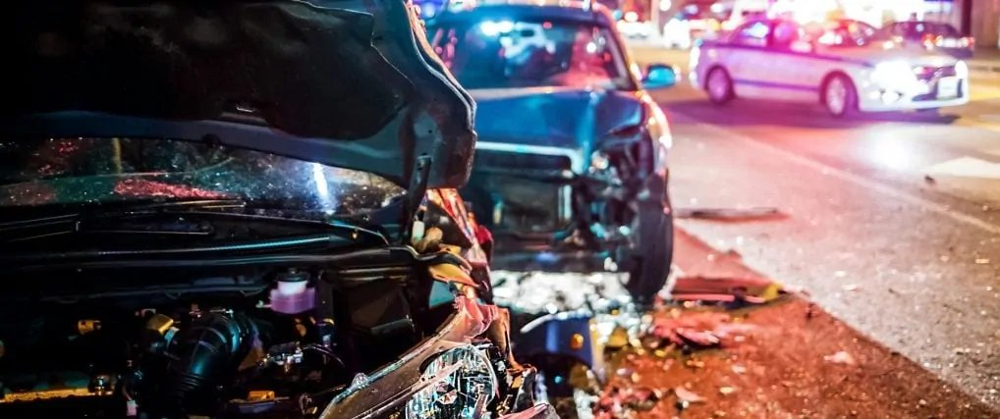

# Proyecto Individual Nº2: DA

## Siniestros Viales

### Resumen:

Este proyecto tiene como objetivo responder ante un hipotético
requerimiento del Observatorio de Movilidad y Seguridad Vial (OMSV) de
la Ciudad de Buenos Aires con el fin de generar información que permita
tomar medidas para disminuir la cantidad de victimas fatales en
siniestros viales. Para ello se definen 3 KPIs a monitorear

El trabajo se divide en 3 etapas:

1.  Proceso de ETL
2.  Proceso de EDA
3.  Creación y presentación de los datos procesados en un dashboard

En las siguientes secciones se explica con mayor detalle los procesos
realizados en cada apartado

### 1) ETL

El proceso de ETL comienza con la importación del archivo .xlsx que
contiene la información de los accidentes ocurridos en la Ciudad de
Buenos Aires entre los años 2016 y 2021 (homicidios.xlsx) que a su vez
contiene dos hojas, una con la información del evento de cada accidente
accidente y otra con la información pertinente a cada víctima fatal.
Ambas hojas son importadas y trabajadas, en principio, como 2 datasets
independientes (homicidio_vict y homicidio_hecho).

En cada dataset se realizan:

-   normalización de nombre de columnas
-   corrección del tipo de columna al correspondiente por el tipo de dato
-   imputación de NaNs
-   búsqueda de registros duplicados

Adicionalmente, en el dataset homicidio_vict se crea una nueva columna
donde se identifica a cada victima con un rango de edad determinado y en
homicidio_hecho una columna con el dia de la semana cuando se produjo el
accidente.

    INPUT:

    -   homicidios.xls

    OUTPUT:

    -   homicidio_hecho.csv
    -   homicidio_vict.csv

### 2) EDA

En esta sección se realizan la importación de los archivos necesarios
(tanto los producidos en el proceso de ETL como de otras fuentes
complementarias) para llevar a cabo el análisis exploratorio de datos en
forma exhaustiva.

    INPUT:

    -   homicidio_hecho.csv
    -   homicidio_vict.csv
    -   dataset_flujo_vehicular.xlsx: información del flujo de vehículos de la Ciudad de Buenos Aires adquiridos por sensores colocados en determinados puntos de la ciudad.
    -   Información de censos 1991, 2002, 2010, 2022 del Instituto de Estadisticas y Censos de Argentina ([https://portalgeoestadistico.indec.gob.ar](https://portalgeoestadistico.indec.gob.ar/))

El trabajo de analisis de exploración fue divido en 4 subsecciones: por
tipo de vehículo, cronológico, por edad, y geográfico.

#### Análisis por tipo de vehículo:

Se determinó que la incidencia del tipo de vehículo, tanto del utilizado
por la victima como el utilizado por el acusado, en el total de víctimas
fatales por accidentes de transito obteniéndose que la mayoría de las
víctimas se encontraban utilizando motos, autos o eran peatones mientras
que los vehiculos utilizados por los acusados que produjeron más
victimas fueron autos, medios de transporte de pasajeros y de carga.

#### Análisis temporal de eventos:

En esta subsección se analizaron la evolución temporal de distintas
categorías con varias bases temporales.

-   **Evolución semestral del número de víctimas totales**
-   Evolución mensual del número de víctimas totales
-   **Evolución annual del número de víctimas motociclistas (conductores o acompañantes)**

La importancia de dos de estos indicadores lleva a la decisión de determinar como objetivo a alcanzar que el número total de víctimas de accidentes viales disminuya un 10% en forma semestral mientras que, por ser el tipo de vehículo mas predominante entre las víctimas, se colocó como objetivo que el número de motociclista fallecidos en accidentes disminuya un 7% en forma interanual.

Adicionalmente se analizaron la distribución temporal de los accidentes
fatales en base mensual (víctimas por mes del año), semanal (víctimas
por día de semana), horaria (victimas por hora del dia por dia de la
semana)

-   Víctimas totales por día de semana
-   Víctimas totales por día de semana discrimanado por tipo de vehículo de la víctima
-   Número de víctimas totales según el dia de la semana y la hora del día
-   Número de víctimas motociclistas según el día de la semana y la hora del día
-   Número de víctimas peatón según el día de la semana y la hora del día
-   Número de víctimas totales por mes del año
-   Número de víctimas totales por mes del año discriminado por tipo de vehículo de la víctima

Para comparar los datos procedentes de distintos momentos temporales se
procedió a normalizar los valores de víctimas reportados por la
población de la ciudad de Buenos Aires en el momento en particular para
el cual se esté reportando un valor. Los datos de población fueron
extraídos de la base de datos del Instituto de Censos y Estadística de
Argentina, en particular los correspondientes a los años 2002, 2010 y
2022. Como el rango temporal analizado se encuentra comprendido entre
los años 2016 y 2021 (por lo tanto, comprendido entre los censos 2010 y
2022 pero sin incluirlos) se procedió a realizar una regresión lineal de
los datos del censo y los valores de población fueron estimados a través
de la función lineal que mejor ajusta a los datos censales.

#### Análisis por edad de la víctima:

En esta subsección se categoriza a las víctimas por el rango etario al
que pertenecen y la incidencia de cada tipo de vehículo utilizado tanto
por la víctima como por el acusado en el número de víctimas dentro de
cada grupo etario.

Adicionalmente se determina el número de víctimas por día de la semana y
hora del día cuando las víctimas motociclistas tenían una edad
comprendida entre los 18 y 29 años, y cuando las víctimas eran peaton de
60 años o más.

#### Análisis geográfico:

Se analizaron la distribución geográfica de los incidentes que
provocaron fatalidades, tanto como número totales como discrimando por
los tres tipos de vehículos más predominantes entre las víctimas,
encontrándose que **la comuna Nº1 es la que más víctimas acumuladas
presenta en su jurisdicción entre los años 2016 y 2021**.

Se analizó la evolución interanual de la cantidad de fallecidos en la
comuna Nº1 y se estableció como tercer KPI a que la variación interanual
de víctimas en esta comuna debía tener una disminución de al menos un
10% para considerar que el objetivo fue alcanzado.
